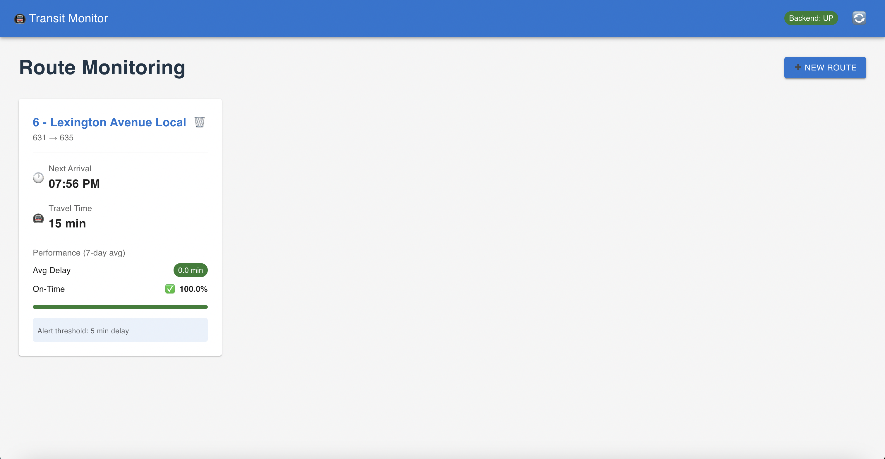
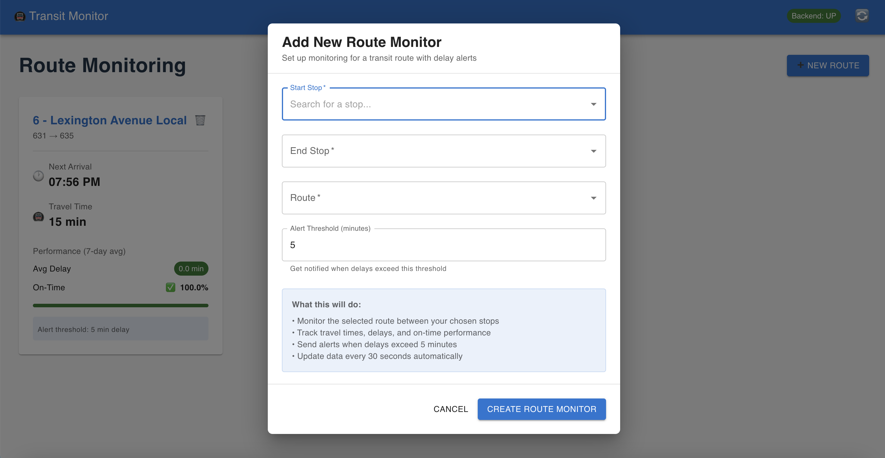

# 🚇 Transit Monitor

A real-time transit monitoring application that tracks route performance, delays, and provides intelligent alerts for public transportation systems.


*Real-time route monitoring dashboard with performance analytics*

## 📋 Table of Contents

- [Overview](#overview)
- [Features](#features)
- [Screenshots](#screenshots)
- [Technical Architecture](#technical-architecture)
- [Quick Start](#quick-start)
- [API Documentation](#api-documentation)
- [Development](#development)
- [Contributing](#contributing)

## 🎯 Overview

Transit Monitor is a comprehensive solution for monitoring public transportation routes in real-time. Built with modern web technologies, it provides transit agencies and commuters with actionable insights into route performance, delays, and on-time statistics.

### Key Capabilities

- **Real-time Route Monitoring**: Track multiple transit routes simultaneously
- **Performance Analytics**: 7-day historical analysis of delays and on-time performance
- **Intelligent Alerts**: Customizable delay thresholds with automatic notifications
- **GTFS Integration**: Supports standard GTFS and GTFS-realtime feeds
- **Modern UI**: Responsive dashboard with Material-UI components

## ✨ Features

### 🚌 Route Management
- Add and monitor multiple transit routes
- Configure custom delay alert thresholds
- Real-time arrival predictions
- Travel time calculations

### 📊 Analytics
- On-time performance percentages
- Average delay calculations
- Historical trend analysis
- Visual performance indicators

### 🔔 Smart Alerts
- Configurable delay thresholds
- Automatic monitoring every minute
- Real-time notifications
- Performance-based alerting

### 🗄️ Data Management
- GTFS static data integration
- Real-time feed processing
- Data freshness validation
- Automatic cleanup of stale data

## 📸 Screenshots

### Main Dashboard

*Clean, modern interface showing route cards with real-time data*

### Add Route Dialog

*Intuitive dialog for adding new route monitors with stop and route selection*


## 🏗️ Technical Architecture

### Backend (Spring Boot + Java)

```
backend/
├── src/main/java/com/example/transit/
│   ├── model/                 # JPA Entities
│   │   ├── Stop.java         # Transit stops
│   │   ├── Route.java        # Transit routes
│   │   ├── StopTime.java     # Scheduled times
│   │   ├── Arrival.java      # Actual arrivals
│   │   └── RouteAlert.java   # User alerts
│   ├── repository/           # Data Access Layer
│   │   ├── StopRepository.java
│   │   ├── RouteRepository.java
│   │   ├── StopTimeRepository.java
│   │   ├── ArrivalRepository.java
│   │   └── RouteAlertRepository.java
│   ├── service/              # Business Logic
│   │   ├── EtaService.java          # Real-time data processing
│   │   ├── GtfsDataLoader.java      # Static data loading
│   │   ├── RouteAnalyticsService.java # Performance calculations
│   │   └── AlertService.java        # Alert monitoring
│   └── web/                  # REST Controllers
│       ├── EtaController.java
│       └── RouteController.java
└── src/main/resources/
    ├── application.yaml      # Configuration
    └── db/migration/         # Database schema
        ├── V1__init.sql
        ├── V2__stop_times.sql
        ├── V3__arrivals.sql
        └── V4__route_alerts.sql
```

### Frontend (React + Material-UI)

```
frontend/frontend/
├── src/
│   ├── components/           # React Components
│   │   ├── RouteCard.jsx     # Route monitoring cards
│   │   └── RouteDialog.jsx   # Add route dialog
│   ├── api/                  # API Client
│   │   └── client.js         # Backend communication
│   ├── App.jsx              # Main application
│   └── App.css              # Custom styles
└── package.json             # Dependencies
```

### Database Schema

```sql
-- Core transit data
stops (id, name, lat, lon)
routes (id, short_name, long_name)
stop_times (trip_id, route_id, stop_id, stop_sequence, scheduled_arrival_ts)

-- Real-time data
arrivals (trip_id, route_id, stop_id, actual_arrival_ts, scheduled_arrival_ts, delay_seconds)

-- User data
route_alerts (user_id, start_stop_id, end_stop_id, route_id, alert_threshold_minutes)
```

## 🚀 Quick Start

### Prerequisites

- Java 17+
- Node.js 18+
- PostgreSQL 13+
- Docker (optional)

### Backend Setup

1. **Start Database**
   ```bash
   cd backend
   docker-compose up -d
   ```

2. **Configure Application**
   ```bash
   # Update application.yaml with your database credentials
   # Set GTFS feed URLs
   ```

3. **Run Backend**
   ```bash
   cd backend
   mvn spring-boot:run
   ```

### Frontend Setup

1. **Install Dependencies**
   ```bash
   cd frontend/frontend
   npm install
   ```

2. **Start Development Server**
   ```bash
   npm run dev
   ```

3. **Access Application**
   - Frontend: http://localhost:5174
   - Backend API: http://localhost:8080

### Load Transit Data

1. **Load GTFS Static Data**
   ```bash
   curl -X POST http://localhost:8080/api/eta/load-data
   ```

2. **Verify Data Loading**
   ```bash
   curl http://localhost:8080/api/eta/load-data
   ```

## 📚 API Documentation

### Core Endpoints

#### Route Management
- `POST /api/routes/alerts` - Create route alert
- `GET /api/routes/alerts` - Get all route alerts
- `DELETE /api/routes/alerts/{id}` - Delete route alert

#### Route Analytics
- `GET /api/routes/summary` - Get route performance summary
- `GET /api/routes/stops` - Get all stops
- `GET /api/routes/routes` - Get all routes

#### Data Management
- `POST /api/eta/load-data` - Load GTFS static data
- `GET /api/eta/load-data` - Get data loading status
- `GET /api/arrivals` - Get arrival count

### Example API Usage

```bash
# Create a route alert
curl -X POST http://localhost:8080/api/routes/alerts \
  -H "Content-Type: application/json" \
  -d '{
    "startStopId": "stop_001",
    "endStopId": "stop_002", 
    "routeId": "route_1",
    "alertThresholdMinutes": 5
  }'

# Get route summary
curl "http://localhost:8080/api/routes/summary?startStopId=stop_001&endStopId=stop_002&routeId=route_1"
```

## 🛠️ Development

### Backend Development

```bash
# Run with hot reload
mvn spring-boot:run

# Run tests
mvn test

# Build JAR
mvn clean package
```

### Frontend Development

```bash
# Development server
npm run dev

# Build for production
npm run build

# Preview production build
npm run preview
```

### Database Management

```bash
# Access PostgreSQL
docker exec -it backend-db-1 psql -U transit -d transit

# View tables
\dt

# Check data
SELECT COUNT(*) FROM stops;
SELECT COUNT(*) FROM routes;
SELECT COUNT(*) FROM arrivals;
```

## 🔧 Configuration

### Backend Configuration (`application.yaml`)

```yaml
spring:
  datasource:
    url: jdbc:postgresql://localhost:5432/transit
    username: transit
    password: transit

gtfs:
  staticZipUrl: "http://web.mta.info/developers/data/nyct/subway/google_transit.zip"
  realtimeFeedUrl: "http://gtfs-realtime.nyc.gov/gtfs-realtime/nyc-subway"

poll:
  intervalMs: 30000
```

### Frontend Configuration

```javascript
// API base URL
const API_BASE = 'http://localhost:8080';
```

## 📊 Data Flow

1. **Static Data Loading**: GTFS zip files are downloaded and parsed
2. **Real-time Processing**: GTFS-realtime feeds are polled every 30 seconds
3. **Data Validation**: Freshness checks prevent stale data
4. **Analytics Calculation**: Performance metrics are computed in real-time
5. **Alert Processing**: Threshold monitoring runs every minute
6. **Frontend Updates**: UI refreshes automatically with latest data

## 🚀 Deployment

### Production Build

```bash
# Backend
cd backend
mvn clean package
java -jar target/transit-backend-0.0.1-SNAPSHOT.jar

# Frontend
cd frontend/frontend
npm run build
# Serve dist/ directory with nginx or similar
```

### Docker Deployment

```yaml
# docker-compose.prod.yml
version: '3.8'
services:
  app:
    build: ./backend
    ports:
      - "8080:8080"
    environment:
      - SPRING_PROFILES_ACTIVE=prod
    depends_on:
      - db
  
  frontend:
    build: ./frontend
    ports:
      - "80:80"
    depends_on:
      - app
  
  db:
    image: postgres:15
    environment:
      POSTGRES_DB: transit
      POSTGRES_USER: transit
      POSTGRES_PASSWORD: transit
```


## 🙏 Acknowledgments

- **GTFS Specification**: For standardized transit data formats
- **MTA**: For providing real-time transit data feeds
- **Spring Boot**: For robust backend framework
- **Material-UI**: For beautiful React components
- **PostgreSQL**: For reliable data storage

---

**Built with ❤️ for better public transportation**
